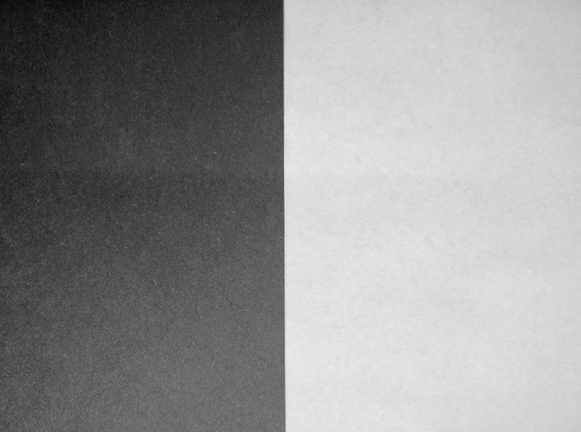
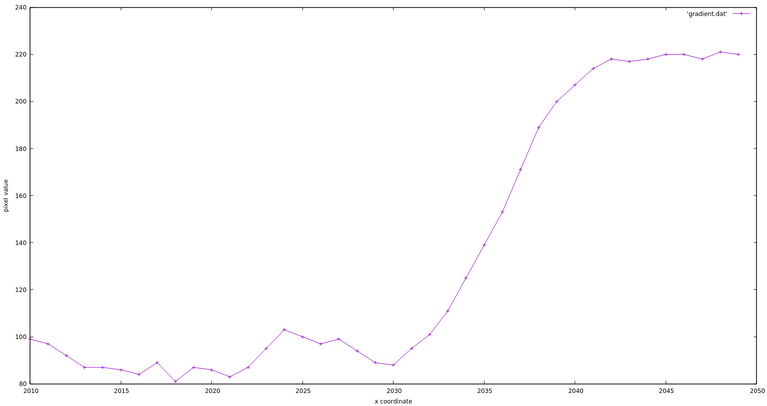
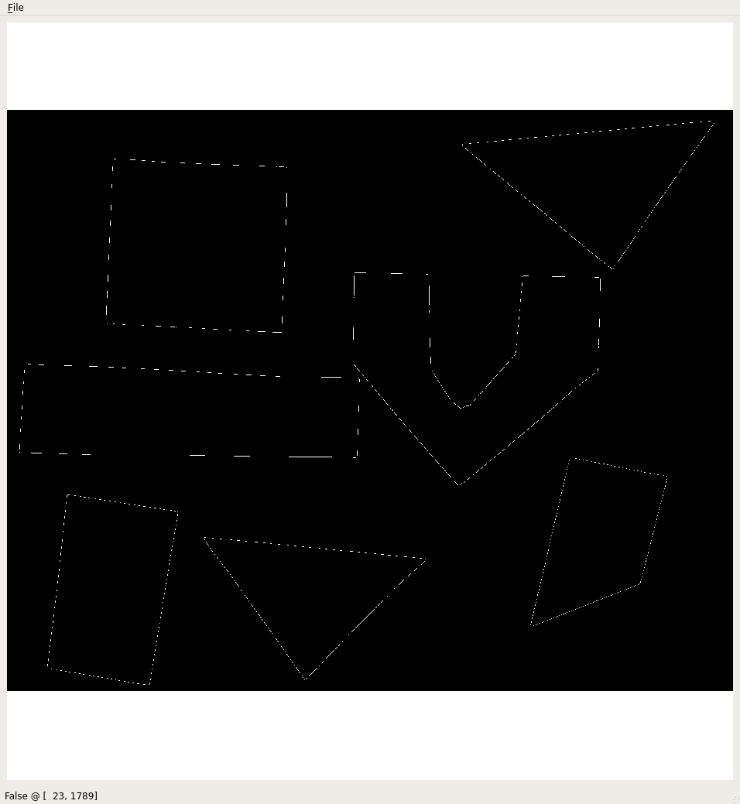
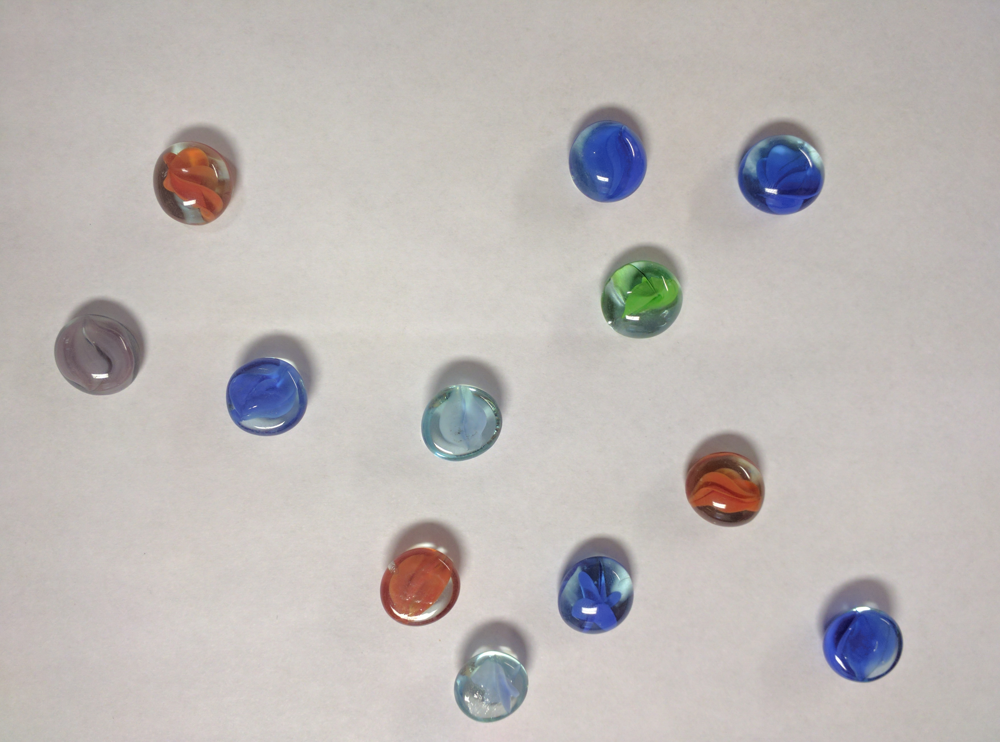
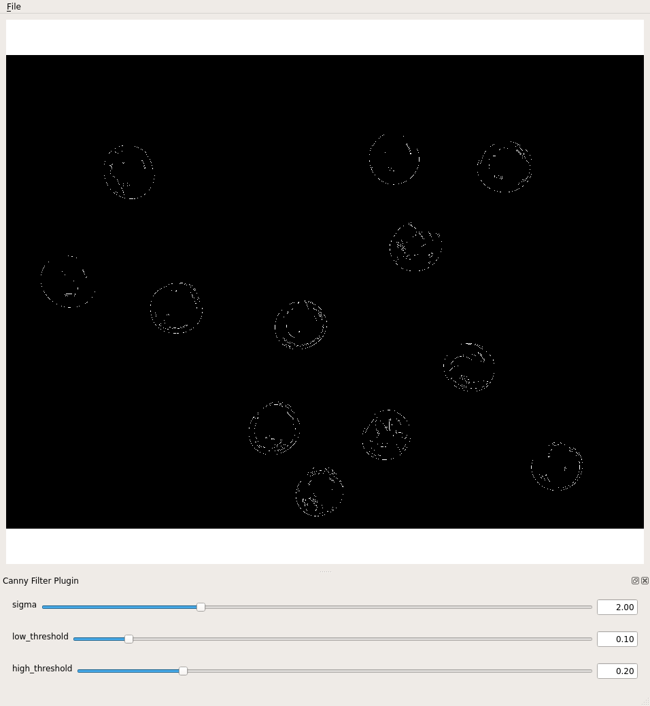
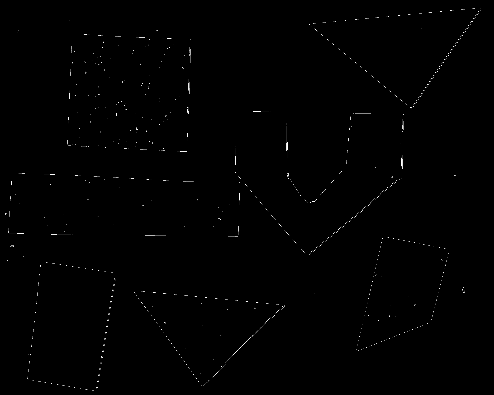
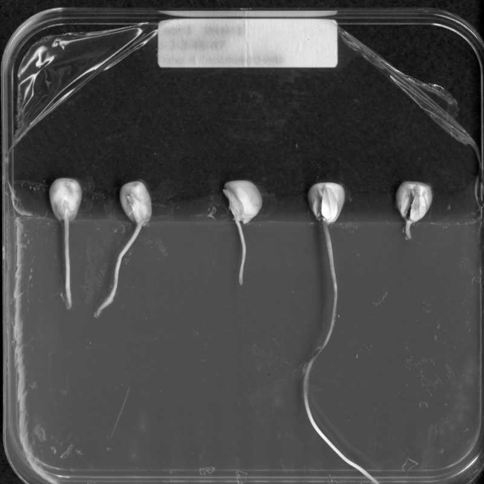

In this episode, we will learn how to use skimage functions to apply *edge
detection* to an image.
In edge detection, we find the boundaries or edges of objects in an image,
by determining where the brightness of the image changes dramatically.
Edge detection can be used to extract the structure of objects in an image.
If we are interested in the number,
size,
shape,
or relative location of objects in an image,
edge detection allows us to focus on the parts of the image most helpful,
while ignoring parts of the image that will not help us.

For example, once we have found the edges of the objects in the image
(or once we have converted the image to binary using thresholding),
we can use that information to find the image *contours*,
which we will learn about in
[the *Connected Component Analysis* episode](../episodes/08-connected-components.md).
With the contours,
we can do things like counting the number of objects in the image,
measure the size of the objects, classify the shapes of the objects, and so on.

As was the case for blurring and thresholding,
there are several different methods in skimage that can be used for edge detection,
so we will examine only one in detail.

## Introduction to edge detection

To begin our introduction to edge detection,
let us look at an image with a very simple edge -
this grayscale image of two overlapped pieces of paper,
one black and and one white:

{alt='Black and white image'}

The obvious edge in the image is the vertical line
between the black paper and the white paper.
To our eyes,
there is a quite sudden change between the black pixels and the white pixels.
But, at a pixel-by-pixel level, is the transition really that sudden?

If we zoom in on the edge more closely, as in this image, we can see
that the edge between the black and white areas of the image is not a clear-cut line.

{alt='Black and white edge pixels'}

We can learn more about the edge by examining the colour values of some of the pixels.
Imagine a short line segment,
halfway down the image and straddling the edge between the black and white paper.
This plot shows the pixel values
(between 0 and 255, since this is a grayscale image)
for forty pixels spanning the transition from black to white.

{alt='Gradient near transition'}

It is obvious that the "edge" here is not so sudden!
So, any skimage method to detect edges in an image must be able to
decide where the edge is, and place appropriately-coloured pixels in that location.

## Canny edge detection

Our edge detection method in this workshop is *Canny edge detection*,
created by John Canny in 1986.
This method uses a series of steps, some incorporating other types of edge detection.
The skimage `skimage.feature.canny()` function performs the following steps:

1. A Gaussian blur
  (that is characterised by the `sigma` parameter,
  see [*Blurring Images*](../episodes/06-blurring.md)
  is applied to remove noise from the image.
  (So if we are doing edge detection via this function,
  we should not perform our own blurring step.)
2. Sobel edge detection is performed on both the cx and ry dimensions,
  to find the intensity gradients of the edges in the image.
  Sobel edge detection computes
  the derivative of a curve fitting the gradient between light and dark areas
  in an image, and then finds the peak of the derivative,
  which is interpreted as the location of an edge pixel.
3. Pixels that would be highlighted, but seem too far from any edge,
  are removed.
  This is called *non-maximum suppression*, and
  the result is edge lines that are thinner than those produced by other methods.
4. A double threshold is applied to determine potential edges.
  Here extraneous pixels caused by noise or milder colour variation than desired
  are eliminated.
  If a pixel's gradient value - based on the Sobel differential -
  is above the high threshold value,
  it is considered a strong candidate for an edge.
  If the gradient is below the low threshold value, it is turned off.
  If the gradient is in between,
  the pixel is considered a weak candidate for an edge pixel.
5. Final detection of edges is performed using *hysteresis*.
  Here, weak candidate pixels are examined, and
  if they are connected to strong candidate pixels,
  they are considered to be edge pixels;
  the remaining, non-connected weak candidates are turned off.

For a user of the `skimage.feature.canny()` edge detection function,
there are three important parameters to pass in:
`sigma` for the Gaussian filter in step one and
the low and high threshold values used in step four of the process.
These values generally are determined empirically,
based on the contents of the image(s) to be processed.

The following program illustrates how the `skimage.feature.canny()` method
can be used to detect the edges in an image.
We will execute the program on the `data/shapes-01.jpg` image,
which we used before in
[the *Thresholding* episode](../episodes/07-thresholding.md):

{alt='coloured shapes'}

We are interested in finding the edges of the shapes in the image,
and so the colours are not important.
Our strategy will be to read the image as grayscale,
and then apply Canny edge detection.
Note that when reading the image with `iio.imread(..., mode="L")`
the image is converted to a grayscale image of same dtype.

This program takes three command-line arguments:
the filename of the image to process,
and then two arguments related to the double thresholding
in step four of the Canny edge detection process.
These are the low and high threshold values for that step.
After the required libraries are imported,
the program reads the command-line arguments and
saves them in their respective variables.

```python
"""
 * Python script to demonstrate Canny edge detection.
 *
 * usage: python CannyEdge.py <filename> <sigma> <low_threshold> <high_threshold>
"""
import imageio.v3 as iio
import matplotlib.pyplot as plt
import skimage.feature
import sys

# read command-line arguments
filename = sys.argv[1]
sigma = float(sys.argv[2])
low_threshold = float(sys.argv[3])
high_threshold = float(sys.argv[4])
```

Next, the original images is read, in grayscale, and displayed.

```python
# load and display original image as grayscale
image = iio.imread(uri=filename, mode="L")
plt.imshow(image)
```

Then, we apply Canny edge detection with this function call:

```python
edges = skimage.feature.canny(
    image=image,
    sigma=sigma,
    low_threshold=low_threshold,
    high_threshold=high_threshold,
)
```

As we are using it here, the `skimage.feature.canny()` function takes four parameters.
The first parameter is the input image.
The `sigma` parameter determines
the amount of Gaussian smoothing that is applied to the image.
The next two parameters are the low and high threshold values
for the fourth step of the process.

The result of this call is a binary image.
In the image, the edges detected by the process are white,
while everything else is black.

Finally, the program displays the `edges` image,
showing the edges that were found in the original.

```python
# display edges
skimage.io.imshow(edges)
```

Here is the result, for the coloured shape image above,
with sigma value 2.0, low threshold value 0.1 and high threshold value 0.3:

{alt='Output file of Canny edge detection'}

Note that the edge output shown in an skimage window may look significantly
worse than the image would look
if it were saved to a file due to resampling artefacts in the interactive image viewer.
The image above is the edges of the junk image, saved in a PNG file.
Here is how the same image looks when displayed in an skimage output window:

{alt='Output window of Canny edge detection'}

## Interacting with the image viewer using viewer plugins

As we have seen, for a user of the `skimage.feature.canny()` edge detection function,
three important parameters to pass in are sigma,
and the low and high threshold values used in step four of the process.
These values generally are determined empirically,
based on the contents of the image(s) to be processed.

Here is an image of some glass beads that we can use as
input into a Canny edge detection program:

{alt='Beads image'}

We could use the `code/edge-detection/CannyEdge.py` program above
to find edges in this image.
To find acceptable values for the thresholds,
we would have to run the program over and over again,
trying different threshold values and examining the resulting image,
until we find a combination of parameters that works best for the image.

*Or*, we can write a Python program and
create a viewer plugin that uses skimage *sliders*,
that allow us to vary the function parameters while the program is running.
In other words, we can write a program that presents us with a window like this:

{alt='Canny UI'}

Then, when we run the program, we can use the sliders to
vary the values of the sigma and threshold parameters
until we are satisfied with the results.
After we have determined suitable values,
we can use the simpler program to utilise the parameters without
bothering with the user interface and sliders.

Here is a Python program that shows how to apply Canny edge detection,
and how to add sliders to the user interface.
There are four parts to this program,
making it a bit (but only a *bit*)
more complicated than the programs we have looked at so far.
The added complexity comes from setting up the sliders for the parameters
that were previously read from the command line:
In particular, we have added

- The `canny()` filter function that returns an edge image,
- The `cannyPlugin` plugin object, to which we add
- The sliders for *sigma*, and *low* and *high threshold* values, and
- The main program, i.e., the code that is executed when the program runs.

We will look at the main program part first, and then return to writing the plugin.
The first several lines of the main program are easily recognizable at this point:
saving the command-line argument,
reading the image in grayscale,
and creating a window.

```python
"""
 * Python script to demonstrate Canny edge detection
 * with sliders to adjust the thresholds.
 *
 * usage: python CannyTrack.py <filename>
"""
import imageio.v3 as iio
import matplotlib.pyplot as plt
import skimage.feature
import skimage.viewer
import sys


filename = sys.argv[1]
image = iio.imread(uri=filename, mode="L")
viewer = plt.imshow(image)
```

The `skimage.viewer.plugins.Plugin` class is designed to manipulate images.
It takes an `image_filter` argument in the constructor that should be a function.
This function should produce a new image as an output,
given an image as the first argument,
which then will be automatically displayed in the image viewer.

```python
# Create the plugin and give it a name
canny_plugin = skimage.viewer.plugins.Plugin(image_filter=skimage.feature.canny)
canny_plugin.name = "Canny Filter Plugin"
```

We want to interactively modify the parameters of the filter function interactively.
Skimage allows us to further enrich the plugin by adding widgets, like
`skimage.viewer.widgets.Slider`,
`skimage.viewer.widgets.CheckBox`,
`skimage.viewer.widgets.ComboBox`.
Whenever a widget belonging to the plugin is updated,
the filter function is called with the updated parameters.
This function is also called a callback function.
The following code adds sliders for `sigma`, `low_threshold` and `high_thresholds`.

```python
# Add sliders for the parameters
canny_plugin += skimage.viewer.widgets.Slider(
    name="sigma", low=0.0, high=7.0, value=2.0
)
canny_plugin += skimage.viewer.widgets.Slider(
    name="low_threshold", low=0.0, high=1.0, value=0.1
)
canny_plugin += skimage.viewer.widgets.Slider(
    name="high_threshold", low=0.0, high=1.0, value=0.2
)
```

A slider is a widget that lets you choose a number by dragging a handle along a line.
On the left side of the line, we have the lowest value,
on the right side the highest value that can be chosen.
The range of values in between is distributed equally along this line.
All three sliders are constructed in the same way:
The first argument is the name of the parameter that is tweaked by the slider.
With the arguments `low`, and `high`,
we supply the limits for the range of numbers that is represented by the slider.
The `value` argument specifies the initial value of that parameter,
so where the handle is located when the plugin is started.
Adding the slider to the plugin makes the values available as
parameters to the `filter_function`.

:::::::::::::::::::::::::::::::::::::::::  callout

## How does the plugin know how to call the filter function with the parameters?

The filter function will be called with the slider parameters
according to their *names* as *keyword* arguments.
So it is very important to name the sliders appropriately.


::::::::::::::::::::::::::::::::::::::::::::::::::

Finally, we add the plugin the viewer and display the resulting user interface:

```python
# add the plugin to the viewer and show the window
viewer += canny_plugin
viewer.show()
```

Here is the result of running the preceding program on the beads image,
with a sigma value 1.0,
low threshold value 0.1 and high threshold value 0.3.
The image shows the edges in an output file.

{alt='Beads edges (file)'}

:::::::::::::::::::::::::::::::::::::::  challenge

## Applying Canny edge detection to another image (5 min)

Now, run the program above on the image of coloured shapes,
`data/shapes-01.jpg`.
Use a sigma of 1.0 and adjust low and high threshold sliders
to produce an edge image that looks like this:

{alt='coloured shape edges'}

What values for the low and high threshold values did you use to
produce an image similar to the one above?

:::::::::::::::  solution

## Solution

The coloured shape edge image above was produced with a low threshold
value of 0.05 and a high threshold value of 0.07.
You may be able to achieve similar results with other threshold values.


:::::::::::::::::::::::::

::::::::::::::::::::::::::::::::::::::::::::::::::

:::::::::::::::::::::::::::::::::::::::  challenge

## Using sliders for thresholding (30 min)

Now, let us apply what we know about creating sliders to another,
similar situation.
Consider this image of a collection of maize seedlings,
and suppose we wish to use simple fixed-level thresholding to
mask out everything that is not part of one of the plants.

{alt='Maize roots image'}

To perform the thresholding, we could first create a histogram,
then examine it, and select an appropriate threshold value.
Here, however, let us create an application with a slider to set the threshold value.
Create a program that reads in the image,
displays it in a window with a slider,
and allows the slider value to vary the threshold value used.
You will find the image at `data/maize-roots-grayscale.jpg`.

:::::::::::::::  solution

## Solution

Here is a program that uses a slider to vary the threshold value used in
a simple, fixed-level thresholding process.

```python
"""
 * Python program to use a slider to control fixed-level
 * thresholding value.
 *
 * usage: python interactive_thresholding.py <filename>
"""

import imageio.v3 as iio
import skimage
import skimage.viewer
import sys

filename = sys.argv[1]


def filter_function(image, sigma, threshold):
    masked = image.copy()
    masked[skimage.filters.gaussian(image, sigma=sigma) <= threshold] = 0
    return masked


smooth_threshold_plugin = skimage.viewer.plugins.Plugin(
    image_filter=filter_function
)

smooth_threshold_plugin.name = "Smooth and Threshold Plugin"

smooth_threshold_plugin += skimage.viewer.widgets.Slider(
    "sigma", low=0.0, high=7.0, value=1.0
)
smooth_threshold_plugin += skimage.viewer.widgets.Slider(
    "threshold", low=0.0, high=1.0, value=0.5
)

image = iio.imread(uri=filename, mode="L")

viewer = skimage.viewer.ImageViewer(image=image)
viewer += smooth_threshold_plugin
viewer.show()
```

Here is the output of the program,
blurring with a sigma of 1.5 and a threshold value of 0.45:

{alt='Thresholded maize roots'}


:::::::::::::::::::::::::

::::::::::::::::::::::::::::::::::::::::::::::::::

Keep this plugin technique in your image processing "toolbox."
You can use sliders (or other interactive elements,
see [the skimage documentation](https://scikit-image.org/docs/dev/api/skimage.viewer.widgets.html))
to vary other kinds of parameters, such as sigma for blurring,
binary thresholding values, and so on.
A few minutes developing a program to tweak parameters like this can
save you the hassle of repeatedly running a program from the command line
with different parameter values.
Furthermore, skimage already comes with a few viewer plugins that you can
check out in [the documentation](https://scikit-image.org/docs/dev/api/skimage.viewer.plugins.html).

## Other edge detection functions

As with blurring, there are other options for finding edges in skimage.
These include `skimage.filters.sobel()`,
which you will recognise as part of the Canny method.
Another choice is `skimage.filters.laplace()`.


